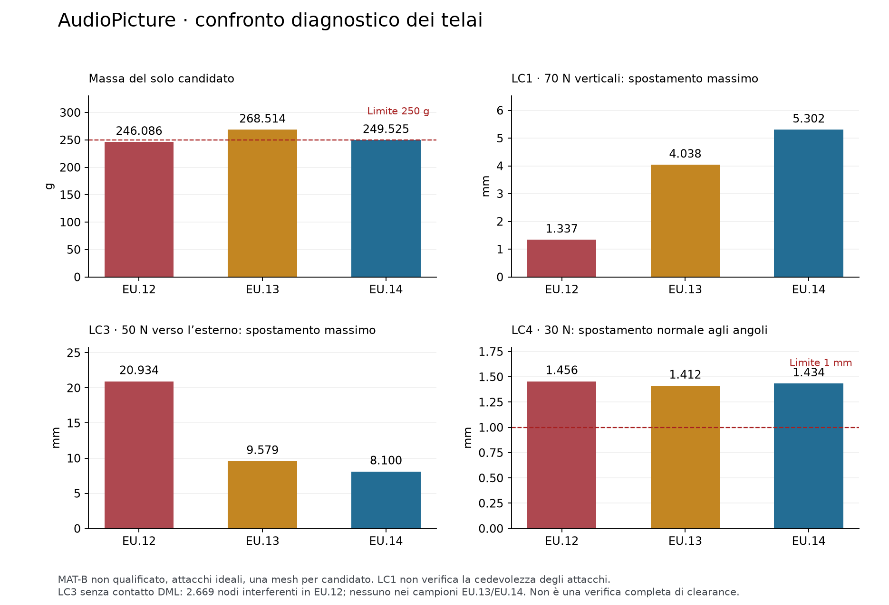

# AudioPicture — verifiche Rev.FB, 7 ottobre 2026

**Il prodotto resta non qualificato per il primo assemblaggio completo.**
Sono state realmente generate e analizzate due ulteriori varianti del telaio.
Le sei esecuzioni CalculiX terminano e superano il controllo di equilibrio;
questo non equivale all'accettazione meccanica del prodotto.

Base di questa iterazione: `1fa4e20bd5b269b2e426532804c44618d667d176`.
Le esecuzioni dei solver sono del 6 ottobre; consolidamento e pubblicazione
proseguono il 7 ottobre. I timestamp UTC originali restano nei file di evidenza.

## Cambiamenti ed esiti

EU.13 sostituisce le nervature 6,4 × 2,8 mm di EU.12 con una sezione a croce:
anima 2,4 × 8 mm e flangia centrale 6,4 × 2,4 mm, tra Z20 e Z28.
L'area cresce da 17,92 a 28,8 mm²; il secondo momento fuori piano cresce
analiticamente da 11,7077 a 107,008 mm⁴, mentre quello nel piano passa da
61,1669 a 58,88 mm⁴. Queste sono proprietà geometriche della sezione libera,
non fattori di miglioramento del telaio completo.

- Volume **220093,494774 mm³**; massa omogenea **268,514064 g** alla densità
  di catalogo 1,22 g/cm³: **FAIL** dell'obiettivo 250 g.
- LC1, 70 N verticali: spostamento massimo risultante **4,038098 mm**.
- LC3, 50 N verso l'esterno: spostamento massimo **9,579201 mm**;
  nessun nodo campionato interferisce con il DML.
- LC4, 30 N all'angolo inferiore destro: spostamento normale massimo agli
  angoli **1,412146 mm**: **FAIL** del limite 1 mm.

EU.14 ripristina nervature 2,8 × 6,4 mm e aggiunge sei collegamenti intermedi
tra le guide interne e il perimetro profondo. Montanti 2,4 × 2,8 mm tra Z6
e Z35 assicurano che i collegamenti raggiungano le flange del perimetro,
senza terminare nei vuoti tra le diagonali. Restano gli altri dettagli EU.12.

- Volume **204528,458217 mm³**; massa omogenea **249,524719 g**: sotto 250 g
  per il solo candidato. Il margine di circa **0,475 g** non copre il lavoro
  residuo su raccordi, fissaggi e portacomponenti; non è un budget finale.
- LC1: spostamento massimo risultante **5,301586 mm**. Non è un miglioramento
  rispetto a EU.12 e non verifica lo spostamento degli attacchi, qui vincolati.
- LC3: spostamento massimo **8,099859 mm**; nessun nodo campionato interferisce
  con il DML.
- LC4: spostamento normale massimo agli angoli **1,434103 mm**: **FAIL**.

Entrambi i CAD sono un singolo solido BREP valido, con STEP reimportato valido,
**22 controlli di sovrapposizione a zero**, distanza shell 1,0 mm e carrier
frontale 0,5 mm. Queste verifiche sono nominali, con ingombri ancora semplificati.
La mesh EU.13 ha 189518 nodi e 92508 tetraedri quadratici, minSICN 0,004861;
EU.14 ha 155440 nodi e 74680 tetraedri quadratici, minSICN 0,006393.
La positività del Jacobiano/indicatore non dimostra convergenza.

## Limiti e decisione

Le simulazioni mantengono lo stesso schema di carico normalizzato e materiale
MAT-B di screening, non proprietà misurate: E1=E2=1900 MPa, E3/E1=0,35,
G13/G12=G23/G12=0,40. Il carico è ripartito sul volume strutturale con CG
XY imposto a 160/200 mm; non è la distribuzione reale delle masse assemblate.
I fori superiori rappresentano inserti/cleat perfettamente vincolati.
LC3/LC4 includono geometria nonlineare, 202 contatti inferiori unilaterali,
penalità totale 100000 N/mm e vincolo normale ideale dell'anti-lift.

Il controllo deformato confronta i nodi con il volume DML. Un'interferenza
rilevata è sufficiente a bocciare quel controllo; la sua assenza **non prova
la clearance continua degli elementi**. Manca il contatto DML nel solver,
oltre alle interfacce reali. Nessun margine qualificato di resistenza,
cedimento, distacco degli attacchi o risposta dopo contatto viene dichiarato.

EU.13 ed EU.14 **non sono accettati per assemblaggio**. Le modifiche riducono
l'interferenza osservata in EU.12 nel campionamento LC3, ma non risolvono la
torsione né tutti i vincoli di massa e rigidezza. Le matrici estese sulle due revisioni non sono state eseguite.
Servono un ulteriore ridisegno dei percorsi di carico e delle interfacce reali,
seguito da LC1–LC7, sensitività materiali/CG, contatto, mesh e buckling sulla
geometria corrente. Nessun risultato EU.4 viene trasferito alle nuove revisioni.

## Repository e lavoro residuo

Sorgenti, metriche e log compatti sono destinati a `main`; CAD, mesh, deck e
campi completi sono conservati negli archivi del checkpoint. La pubblicazione
è verificata separatamente mediante commit, nomi, dimensioni e SHA-256 degli
allegati confrontati con i digest di GitHub. Vedere `docs/validation-checkpoints.md`.

Il registro contiene **38 PASS, 17 FAIL e 15 OPEN**, compresi controlli storici
e diagnostici circoscritti. Non è una percentuale di completamento.

Restano lavoro digitale dell'agente: telaio conforme e fissaggi reali,
pareti/tenute/aperture/cablaggi completi, integrazione ottica e camera SHT45,
CFD01–CFD05 del prodotto, schemi MAIN/VOICE/RADAR, tutti i PCB, BOM completa
e funzioni firmware audio/voce/radar/OTA/governor integrate. Le verifiche
geometriche del labyrinth EQ e del candidato ottico FA mantengono i loro
ambiti; non diventano validazioni termiche, acustiche o radiometriche.

Nessun test fisico è stato eseguito. I piani coupon e P01–P16 restano pronti,
in attesa di misure reali di materiali, inserti, magneti e del prototipo.
