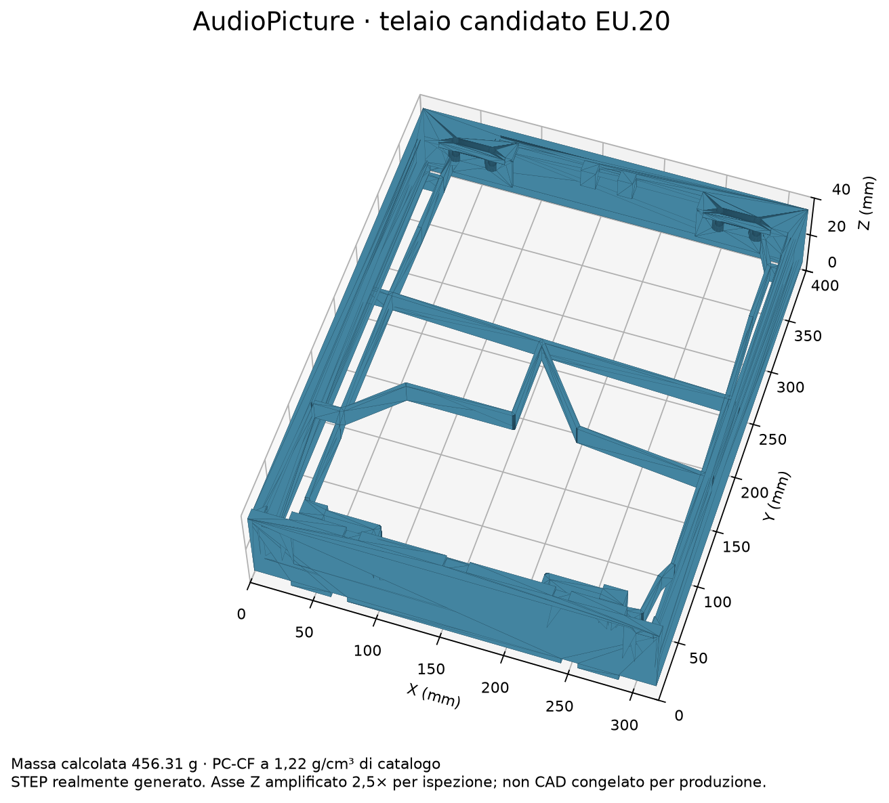
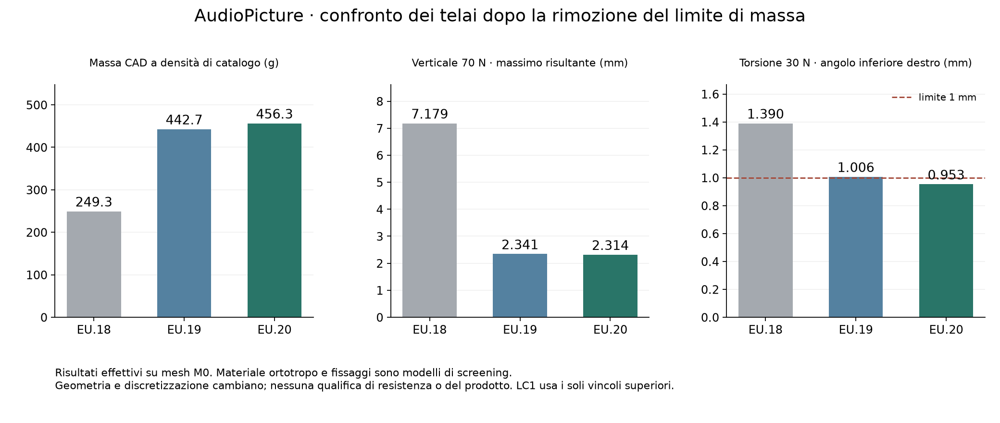

# AudioPicture — massa e verifiche strutturali Rev.FD, 8 ottobre 2026

**Il limite di 250 g è superato per autorizzazione dell'utente. Il prodotto
resta non qualificato per il primo assemblaggio completo.**

Base verificata: `dfe1c09d39ed9c9d843f3c43f73ca6556a68587a`.
Sono realmente eseguiti due nuovi CAD, quattro mesh e 13 prove CalculiX 2.23.
Il nuovo requisito è in [mass-policy-rev-fd.md](mass-policy-rev-fd.md): nessun
nuovo tetto arbitrario, con massa, baricentro e adeguatezza dei carichi da verificare.
I vecchi FAIL di sola massa restano documentati come storici e non sono più
criteri di esclusione. Non cambiano i requisiti di rigidezza, resistenza,
ingombro, RF, ventilazione e integrazione.

## Geometria realmente generata

EU.19 sostituisce il reticolo periferico con due anime continue PC-CF da 2,4 mm,
porta le nervature primarie a 3,2 × 8 mm e riempie il traverso inferiore centrale.
Massa omogenea calcolata **442.654840 g**.
EU.20 concentra ulteriori rinforzi nel percorso inferiore: collegamenti laterali
larghi 4,8 mm, diagonali verso gli angoli 6,4 mm, traverso pieno esteso agli estremi
entro Y3,2..12 mm per evitare le celle del labyrinth. Massa **456.314678 g**,
pari a 13.659838 g aggiuntivi rispetto a EU.19.

Sono masse calcolate con densità di catalogo 1,22 g/cm³, non pesate. Mancano
inserti, cleat esatti, raccordi e interfacce finali; infill/processo e proprietà
stampate non sono qualificati. La sezione piena è un candidato per valutare la
rigidezza, da affinare per produzione dopo la verifica dei percorsi di carico.

Entrambi: BREP valido, un solo solido, STEP reimportato valido, 22 verifiche di
sovrapposizione nominale a zero; distanza dal shell EQ 1,0 mm e carrier FA 0,5 mm.
Il DML, i componenti, la maschera RF e il labyrinth sono quelli dei modelli
semplificati verificati. Restano tolleranze, geometrie esatte, connessioni,
RF completa e assemblaggio. Nessuna geometria ASA contribuisce alla rigidezza FEM.

## Simulazioni effettive

LC1 è il confronto lineare senza appoggi inferiori/anti-lift. Massimi risultanti:

- EU.19: **2.340859 mm a 70 N** e
  **3.009675 mm a 90 N**.
- EU.20: **2.314278 mm a 70 N** e
  **2.975500 mm a 90 N**.

Il riferimento EU.18 era 7,179289 mm a 70 N. La geometria e la distribuzione
sostitutiva del carico volumetrico cambiano insieme: non è una misura isolata
della rigidezza di un singolo componente. I fori superiori sono prescritti
fissi, quindi lo spostamento nullo dei fori non dimostra il limite di 0,5 mm
dei fissaggi reali. La prova a 90 N non qualifica la portata del prodotto.

LC3 nonlineare, trazione normale verso l'esterno da 50 N:

- EU.19: massimo risultante **2.092529 mm**.
- EU.20: massimo risultante **2.049186 mm**.

Il controllo dei nodi deformati è registrato nei file `deformed-clearance.json`:
zero interferenze campionate con il DML per entrambi. Il nuovo controllo
`quadratic-dml-clearance.json` va oltre i soli nodi: racchiude ogni tetraedro
quadratico nella scatola dei suoi punti di controllo Bernstein e verifica
la separazione dell'intero elemento deformato dal box DML allo stato finale.
EU.19: limite inferiore conservativo della separazione dal box DML **0.323814 mm**, su 97653 elementi completi.
EU.20: limite inferiore conservativo della separazione dal box DML **0.324156 mm**, su 97559 elementi completi.

La verifica riguarda la geometria interpolata FEM e il DML nominale fisso,
non il BREP deformato esatto, tutti gli stati intermedi, le tolleranze o il
contatto reale. Le scatole sono espanse di 1e-7 mm come sola guardia numerica;
una scatola sovrapposta sarebbe inconclusiva, non un'interferenza dimostrata.
Il metodo supera un caso costruito in cui il solo controllo dei nodi manca
un superamento della superficie, oltre a verifiche algebriche campionate.

LC4 nonlineare, 30 N normali all'angolo. Si confronta il massimo **spostamento
normale UZ degli angoli**, non il massimo vettoriale dell'intero telaio:

- EU.19, M0, angolo LR: **1.006463 mm — FAIL** rispetto a 1 mm.
- EU.19, M1, angolo LR: **1.004060 mm — FAIL** rispetto a 1 mm.
- EU.20, M0, angolo LR: **0.953041 mm — PASS** rispetto a 1 mm.
- EU.20, M0, angolo LL: **0.955552 mm — PASS** rispetto a 1 mm.
- EU.20, M0, angolo UL: **0.163397 mm — PASS** rispetto a 1 mm.
- EU.20, M0, angolo UR: **0.166741 mm — PASS** rispetto a 1 mm.
- EU.20, M1, angolo LR: **0.957329 mm — PASS** rispetto a 1 mm.

LR/LL sono inferiore destro/sinistro; UR/UL superiore destro/sinistro.

EU.19: differenza M0/M1 rispetto a M1 **0.239328%**. EU.20: differenza M0/M1 rispetto a M1 **0.447996%**. Queste sono comparazioni di spostamento su due mesh, non la convergenza
contrattuale di tensioni non singolari e spostamenti per tutta la matrice.
Tutte le 13 esecuzioni raggiungono il carico finale e superano il controllo di
equilibrio delle forze entro 0,1% o 0,001 N. Nessun margine di resistenza
qualificato è dichiarato.

## Mesh e ipotesi

- EU.19 M0: 184556 nodi, 97653 C3D10; minSICN 0.00159145; 62 elementi sotto 0,01; zero Jacobiani non positivi.
- EU.19 M1: 284766 nodi, 152071 C3D10; minSICN 0.0016456; 71 elementi sotto 0,01; zero Jacobiani non positivi.
- EU.20 M0: 183498 nodi, 97559 C3D10; minSICN 0.00878118; 2 elementi sotto 0,01; zero Jacobiani non positivi.
- EU.20 M1: 282996 nodi, 151875 C3D10; minSICN 0.0076004; 2 elementi sotto 0,01; zero Jacobiani non positivi.

M0/M1 hanno dimensione globale 4/3 mm, algoritmo Delaunay e ottimizzazione
Netgen prima dell'elevazione quadratica. Cambiano i nodi che campionano
appoggi e carichi; sono preservate regole geometriche e forze totali, non
coordinate nodali identiche. Confronti salvati in `evidence/rev-fd/`.

Materiale MAT-B normalizzato: E1=E2=1900 MPa, E3/E1=0,35,
G13/G12=G23/G12=0,40, nu=0,35. Sono ipotesi, non proprietà ortotrope misurate.
LC3/LC4 includono geometria nonlineare, appoggi inferiori unilaterali senza
attrito, penalità totale 100000 N/mm e anti-lift con vincolo normale ideale.
I quattro fori sono sostituti rigidi degli inserti/cleat. Carichi distribuiti
volumetrici con CG XY 160/200 mm: non rappresentano la distinta reale di massa.
Restano raccordi, tensioni ai punti critici, legge di contatto e cedimenti reali.

## Peso e carichi dell'assemblaggio

I **250 g non sono più un gate**; 1,70 kg è un riferimento storico di budget.
La regola interna da riesaminare è `max(70 N, 4 × massa_kg × 9,80665)`.
Il file `evidence/rev-fd/mass-load-review.json` aggiorna il confronto condizionale
FC con i due nuovi telai, mantenendo esplicite le vecchie riserve e la densità
ASA ipotizzata. Non è una previsione affidabile della massa finale: shell,
cablaggi, schede e fissaggi sono incompleti, così come il baricentro.
Le prove a 90 N sono sensibilità aggiuntive e non certificano i tasselli a parete.

## Registro e lavoro residuo

Registro comprensivo della storia: **64 PASS / 25 FAIL / 18 OPEN**.
Escludendo soltanto gli otto vecchi gate di sola massa: **60 PASS / 21 FAIL / 18 OPEN**.
Entrambi i conteggi includono risultati storici e verifiche circoscritte;
non rappresentano una percentuale di completamento né l'accettazione del prodotto.

Restano attività digitali: fissaggi/inserti/cleat reali, raccordi, matrice completa
LC1–LC7/MAT-A-B-C/CG/contatti/buckling sulla geometria corrente, convergenza dei
punti critici, massa e baricentro completi, involucro/tenute/service/cablaggi,
integrazione ottica e camera SHT45, CFD01–CFD05 con tutte le fisiche richieste,
schemi MAIN/VOICE/RADAR, tutti i PCB, BOM e firmware funzionale completo.
La matrice storica EU.4 non si trasferisce a EU.19/EU.20.

Nessuna CFD del prodotto o prova fisica è dichiarata eseguita. Restano coupon
PC-CF, inserti/cleat, magneti/ritenzione, processo e prove P01–P16 già preparate.
CAD e simulazioni presenti sono candidati di screening, non file da mandare
in produzione come pezzi qualificati.

Per riprodurre i risultati sono conservati STEP, mesh, input e output CalculiX,
log, metriche e SHA-256 nel supplemento Rev.FD, da estrarre sopra FA+FB+FC.
La ricevuta della pubblicazione è distinta dalla verifica ingegneristica;
vedere `docs/validation-checkpoints.md`.
