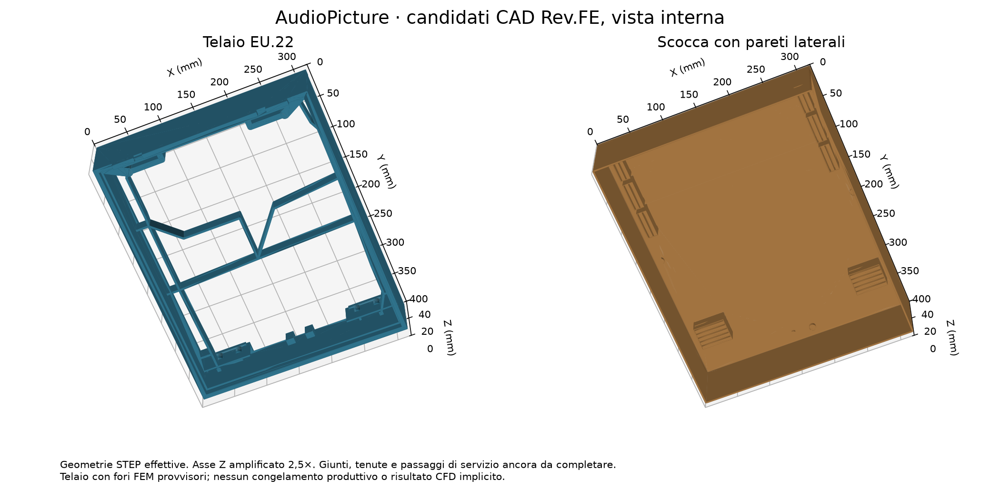
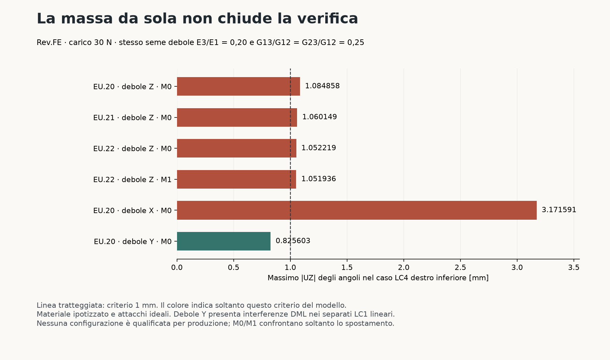

# AudioPicture — verifiche e dati fisici necessari Rev.FE, 9 ottobre 2026

**Nessun candidato è ancora qualificato per produzione. Il limite di massa
250 g resta rimosso.** La verifica più debole del materiale fa fallire LC4
anche sul telaio ulteriormente irrobustito; cambiare orientamento migliora
la torsione, ma non sostituisce la verifica degli altri carichi e del processo.

Base verificata: `1922eb1667b5027569bc569c6152589ecaa66f82`.
Sono eseguite **14 nuove simulazioni del telaio e 18 prove indipendenti
su cubo** con CalculiX 2.23. Sono conservati input, output finali, cronologia
di convergenza, metriche e SHA-256. Tutte le esecuzioni del telaio raggiungono
il carico finale e rispettano il controllo di equilibrio delle forze.
Questo è un PASS dell'esecuzione, non della resistenza del prodotto.

Per organizzare le misure: [elenco operativo completo](../manufacturing/real-data-required-rev-fe.md),
[provino M4](test/insert-installation-pilot-rev-fe.md),
[aggiornamento delle prove fisiche e nuova prova P17](test/physical-qualification-addendum-rev-fe.json).

## Materiale e nuovi telai

Tutte le nuove prove usano E1=E2=1900 MPa, E3=380 MPa,
G12=703,7037 MPa, G13=G23=175,9259 MPa e nu12=nu13=nu23=0,35.
Sono ipotesi normalizzate: E3/E1=0,20 e G13/G12=G23/G12=0,25.
**1900 MPa non è un dato del TDS PC-CF attuale**, come già corretto in
[Rev.EX](component-source-verification-rev-ex.md). Non è un limite inferiore
fisico garantito. Le prove Rev.FD usavano invece il seme MAT-B 0,35/0,40/0,40.
I loro PASS circoscritti restano validi per quegli input, non per tutti i materiali.

- EU.20: **456,314678 g**, candidato della revisione precedente.
- EU.21: **473,690764 g**; allarga i collegamenti inferiori laterali a 8 mm
  e quelli verso gli angoli a 12,8 mm.
- EU.22: **605,105205 g**; aggiunge fasce piene laterali e superiore da 9,4 mm,
  fra Z10,3 e 35 mm. Rispetto a EU.21 aggiunge 131,414440 g, con beneficio
  di soli 0,007930 mm nel confronto LC4 LR M0 del seme debole.

Masse calcolate con densità di catalogo 1,22 g/cm³, non pesate. I due nuovi
BREP e gli STEP reimportati sono validi, un solido, 22 sovrapposizioni nominali
nulle, distanza shell 1 mm e carrier 0,5 mm. Componenti/keep-out sono ancora
le geometrie semplificate documentate. Raccordi, inserti e cleat finali mancano.
EU.22 non è selezionato per produzione: il suo incremento di massa non chiude
il criterio e richiede comunque il completamento delle interfacce.

Le tre nuove mesh sono EU.21 M0 (181441 nodi, 96633 C3D10), EU.22 M0
(169871 nodi, 93844 C3D10) ed EU.22 M1 (273732 nodi, 156046 C3D10).
Tutte hanno zero Jacobiani non positivi; i minimi SICN sono rispettivamente
0,007636, 0,008924 e 0,008730. Non si deduce qualità/convergenza delle tensioni
dal solo segno del Jacobiano. Per EU.20 si riusano le mesh verificate Rev.FD.

## Torsione e orientamento di stampa

LC4 applica 30 N normali all'angolo. Il criterio è il massimo |UZ| degli
insiemi degli angoli, non il massimo vettoriale o il massimo UZ dell'intera mesh.

- EU20, M0-LC4-LL-Ez020-G025/LC4: **1.087790 mm**, FAIL del criterio 1 mm.
- EU20, M0-LC4-LL-Ez020-G025-weakY/LC4: **0.826344 mm**, PASS del solo criterio 1 mm.
- EU20, M0-LC4-LR-Ez020-G025/LC4: **1.084858 mm**, FAIL del criterio 1 mm.
- EU20, M0-LC4-LR-Ez020-G025-weakX/LC4: **3.171591 mm**, FAIL del criterio 1 mm.
- EU20, M0-LC4-LR-Ez020-G025-weakY/LC4: **0.825603 mm**, PASS del solo criterio 1 mm.
- EU21, M0-LC4-LL-Ez020-G025/LC4: **1.061964 mm**, FAIL del criterio 1 mm.
- EU21, M0-LC4-LR-Ez020-G025/LC4: **1.060149 mm**, FAIL del criterio 1 mm.
- EU22, M0-LC4-LL-Ez020-G025/LC4: **1.052079 mm**, FAIL del criterio 1 mm.
- EU22, M0-LC4-LR-Ez020-G025/LC4: **1.052219 mm**, FAIL del criterio 1 mm.
- EU22, M1-LC4-LR-Ez020-G025/LC4: **1.051936 mm**, FAIL del criterio 1 mm.

Per il caso debole X, il massimo UZ dell'intera mesh è 3,234120 mm e quello
agli angoli 3,171591 mm: sono grandezze diverse. Per EU.22 debole Z LR,
M0/M1 differiscono dello **0.026903%**,
ma entrambe falliscono 1 mm. È un confronto di spostamento su due mesh,
non la convergenza completa dei punti critici.

Gli assi del materiale vengono ruotati tramite una base ortonormale destrorsa,
senza aumentare le proprietà o cambiare i carichi. Nei tre confronti orientati
LC4, eliminare soltanto la carta di orientamento e il suo riferimento lascia
un input identico byte per byte al rispettivo caso debole Z.
Le **18 prove su cubo** confrontano trazioni/tagli risolti dal solver con
la deformazione analitica: errore relativo massimo 2,592593e-7.
Questo verifica l'implementazione degli assi, non il PC-CF stampato.

Debole Z corrisponde agli strati XY del prodotto; debole X agli strati YZ;
debole Y agli strati XZ. L'ultimo richiede una stampa sul bordo corto di circa
400 mm d'altezza, processo non accertato. Non sono completati i quattro angoli,
la convergenza e tutta la matrice strutturale nell'orientamento Y.
Vedere [lo studio del processo](print-orientation-study-rev-fe.md).

## Carico verticale e trazione verso l'esterno

EU.20 debole Y, LC1 lineare con soli quattro fori superiori fissi:

- 70 N: massimo vettoriale **4,146077 mm**, 85 nodi previsti nel box DML.
- 100 N: massimo vettoriale **5,922967 mm**, 395 nodi previsti nel box DML.

Sono FAIL del controllo di interferenza di quel modello; il contatto con il
DML non è incluso, quindi la penetrazione non è una previsione fisicamente
realizzabile della risposta dopo il contatto. Il modello non comprende in
questi due casi gli appoggi inferiori e la cattura normale anti-lift.

La prova separata LC1 **nonlineare a 100 N**, con appoggi inferiori unilaterali
senza attrito e cattura normale anti-lift ideale, dà massimo vettoriale
**5.284738 mm** e massimo |UZ|
**0.351290 mm**.
Il controllo nodale dà **57 nodi dentro il DML**;
lo stato dei volumi quadratici è **OPEN_OVERLAPPING_BOUNDS_REQUIRE_REFINEMENT**, con
128 scatole potenzialmente sovrapposte.
Questo confronto cambia insieme cinematica e condizioni inferiori: non isola
un effetto del solo materiale. La cattura ideale richiede un giunto reale
progettato e qualificato; nessun appoggio viene aggiunto al prodotto per deduzione.

La suddivisione successiva dei 128 elementi con scatole sovrapposte trova
95 punti interni al volume FEM nel box DML, di cui **82 oltre la guardia numerica
0,0001 mm**. Il punto più interno rispetto al bordo della regione vietata
ha margine **0.01109993 mm**. Ogni punto è ricostruito anche direttamente
nelle coordinate baricentriche dell'elemento originale: **FAIL di clearance
nel modello**, pur con zero nodi campionati interferenti. Le sottoregioni
non risolte non annullano questi controesempi. La guardia numerica non è
una tolleranza produttiva; nessuna risposta fisica dopo contatto è simulata.
La suddivisione in otto tetraedri supera controlli di volume, partizione
su 512 punti e ricostruzione della mappa quadratica (errore 1,11e-15).

LC3 nonlineare, 50 N verso l'esterno, stesso seme debole Y e interfacce ideali:
**3.330118 mm** massimo vettoriale. Il controllo completo
degli elementi quadratici al carico finale prova separazione dal DML fisso
con limite inferiore conservativo **0.261687 mm**.
Il controllo usa gli inviluppi Bernstein dell'intero elemento; scatole
sovrapposte sarebbero inconclusive, non collisioni dimostrate. Non include
stati intermedi, tolleranze, BREP deformato esatto o DML mobile.

Per tutte queste prove: fori superiori rigidi, penalità totale dei contatti
100000 N/mm, anti-lift normale ideale quando dichiarato, carichi sostitutivi
distribuiti per volume e CG XY 160/200 mm. Lo spostamento imposto nullo dei
fori non verifica il requisito di 0,5 mm dell'attacco reale. Tensioni nodali
estrapolate sono diagnostiche; nessun margine di resistenza è qualificato.

## Scocca e copertura dei percorsi d'aria

Il candidato ASA aggiunge pareti perimetrali da 2,2 mm, bordo frontale Z4,2
ed esterni raccordati R2. Volume **402138,331887 mm³**. BREP, STEP reimportato
e STL verificati; nello STL sono rimossi solo quattro triangoli collassati
con indici ripetuti, senza spostare vertici o riempire aperture.

Sono verificati 36/36 campioni laterali pieni e, tramite differenza booleana
in entrambe le direzioni, nessuna modifica nella regione delle **22 celle EQ**.
Le aperture restano prive di ostruzioni. Distanze nominali telaio 1 mm e carrier
0,5 mm verificate con EU.21 ed EU.22. Non è una scocca completa fabbricabile.

Un controllo BREP dell'intera lunghezza di segmenti concatenati dimostra
**tre percorsi continui** al giunto frontale, a Y180/250/300 mm, con distanza
minima dalle parti modellate di 0,5 mm. I percorsi hanno svolte: non sono
una prova di LOS diretta o una simulazione acustica/di flusso. Dimostrano che
22 vent trattati non equivalgono al trattamento di tutte le aperture del prodotto.
Tenute frontali/DML, service, cavi, passaggi fissaggi e camera ENV restano aperti.

## Inserto e provino effettivo

Il CAD ruthex RX-M4x8.1 originale è reimportato valido, un solido. Il disegno
nominale indica L8,1, Ø6,3, foro Ø5,6 e profondità minima L+1 = 9,1 mm.
Il piccolo superamento dell'estremità del filetto nel bounding box del CAD
fornito non diventa una tolleranza produttiva. I fori temporanei Ø6 × 7 mm
sono **2,1 mm troppo corti** per questa installazione e 0,4 mm più larghi del
nominale: occorre ridisegnare il nodo e rieseguire i gate dipendenti.

Il provino generato ha base 30 × 30 × 2,5 mm, boss Ø12, raccordo R2,
foro Ø5,6 profondo 9,1 e altezza 11,6 mm. BREP/STEP/STL sono validi,
foro libero e fondo continuo. È pronto come CAD per la prova d'installazione,
non come boss qualificato del prodotto o fixture di estrazione. Temperature,
compensazioni, serraggio e resistenze misurate restano assenti.

## Massa e carichi

Nessun nuovo tetto di massa. Lo scenario condizionale EU.22 + pareti ASA
porta le vecchie riserve complessive a circa 2,197–2,217 kg usando densità ASA
**ipotizzate** 1,05–1,10 g/cm³. La regola provvisoria a 4g darebbe circa
86,18–86,97 N. Non è una massa finale pesata: componenti, giunti, guarnizioni,
PCB e cavi restano incompleti. La prova 100 N è una sensibilità aggiuntiva;
70 N resta il minimo di partenza, da verificare rispetto a massa/CG finali.

## Stato e prossime dipendenze

Registro con storia: **78 PASS / 39 FAIL / 21 OPEN**.
Include candidati superati e controlli circoscritti; non è una percentuale
di completamento. I vecchi gate di sola massa restano esplicitamente storici.

1. Completare i veri nodi inserti/cleat/anti-lift e il processo di stampa;
   integrare le misure P01/P02, raccordi, geometria e catena delle tolleranze.
2. Completare tenute, service/cavi, camera ENV e integrazione ottica/PCB,
   con verifica RF e di tutti i passaggi dell'involucro.
3. Eseguire sulla geometria finale LC1–LC7, MAT-A/B/C e tagli, CG, contatti,
   instabilità e convergenza di spostamenti/tensioni con dati qualificati.
4. Completare CFD01–CFD05 del prodotto: gravità, densità termodipendente,
   conduzione, radiazione, aperture reali, gap 3/4/5 mm, bilancio energetico,
   volumi stagnanti e convergenza <5%. Non sono eseguite CFD del prodotto;
   i benchmark Elmer storici non le sostituiscono.
5. Completare schemi MAIN/VOICE/RADAR, tutti i PCB/BOM, firmware funzionale,
   pacchetto produttivo e prove fisiche/di fabbrica tracciabili.

Le misure da procurare sono dettagliate nel documento operativo collegato
all'inizio. Alcune richiedono solo provini; termica, acustica, RF e collaudi
finali richiedono il primo assemblaggio di verifica. **Non sono rimasti soltanto
test fisici**, e la produzione non può essere dichiarata valida prima di essi.

Gli artefatti nuovi sono nel supplemento Rev.FE, da estrarre dopo le quattro
parti Rev.FA e i supplementi FB/FC/FD. La presenza e l'integrità su GitHub
sono verificate separatamente e registrate in `evidence/rev-fe/github-publication.json`
quando disponibili; vedere [la politica di pubblicazione](../docs/validation-checkpoints.md).
